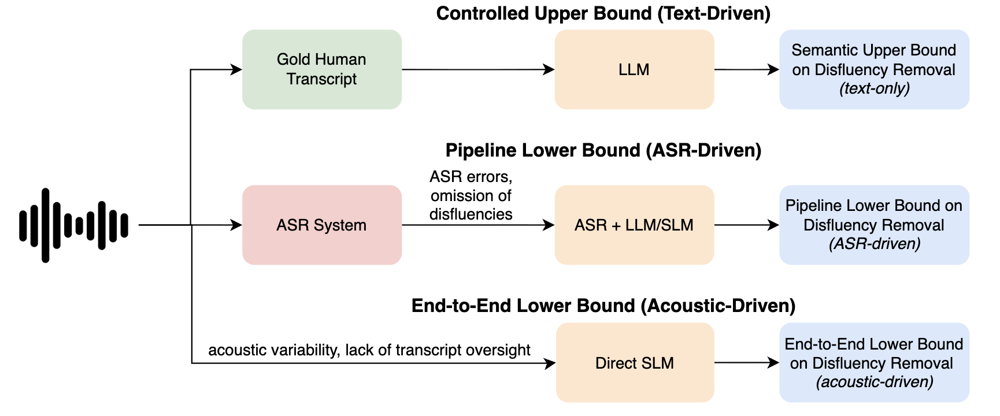

# DRES: Disfluency Removal Evaluation Suite

This repository contains code and experiments for building, running, and evaluating the **Disfluency Removal Evaluation Suite (DRES)**, the first large-scale, systematic benchmark for evaluating large language models (LLMs) on the disfluency removal task. DRES isolates model performance from ASR and acoustic variability by leveraging human-annotated Switchboard transcripts.

This code accompanies our paper,  *DRES: Benchmarking LLMs for Disfluency Removal*.

## ⚡ Quickstart

Obtain [**Switchboard (Treebank-3, LDC99T42)**](https://catalog.ldc.upenn.edu/LDC99T42) and place it in `data/treebank_3/`.

Add credientials for OpenAI API and Hugging Face key to `.env`.

```bash
# Clone repo
git clone https://github.com/mariateleki/dres.git
cd disfluency_removal

# Install the disfluency_removal package locally
pip install -e .

# Run preprocessing
python -m disfluency_removal.data_1_generate_flat
python -m disfluency_removal.data_2_generate_full_segments
python -m disfluency_removal.data_3_generate_kshot
python -m disfluency_removal.data_4_reconstruct_segment

# Run benchmark experiments 
CUDA_VISIBLE_DEVICES=0,1 python -m disfluency_removal.run_inference_experiments -m --config-name sweep-kshot

# Run evaluation
python -m disfluency_removal.data_5_evaluate
python -m disfluency_removal.data_6_analyze_results
python -m disfluency_removal.data_7_create_kshot_plot
```

## 📖 About the Paper

Disfluencies — such as *um, uh, repetitions, and repairs* — are common in conversational speech but degrade performance in speech-driven systems. The DRES benchmark:

* Provides a **controlled, reproducible upper bound** for disfluency removal.
* Evaluates a wide range of **LLMs** (open-source and proprietary, small to very large).
* Benchmarks **prompting strategies, segmentation, and fine-tuning** approaches.
* Identifies **LLM-specific error modes** (over-deletion, under-deletion, reasoning misinterpretation).
* Offers **nine actionable recommendations (R1–R9)** for deploying disfluency removal in speech-driven pipelines.


## 🚀 Features

* Preprocessing pipeline for **Switchboard** (LDC Treebank-3)
* Configurable experiments with **Hydra**
* Fine-grained evaluation metrics: **word-based precision, recall, and F1 scores, and Z-Scores**
* Visualization and aggregation scripts
* Unit tests for reproducibility


## 🔄 Data Processing
Obtain [**Switchboard (Treebank-3, LDC99T42)**](https://catalog.ldc.upenn.edu/LDC99T42) and place it in `data/treebank_3/`.

Run the pipeline scripts to produce intermediate artifacts needed for benchmarking:

```bash
python -m disfluency_removal.data_1_generate_flat
python -m disfluency_removal.data_2_generate_full_segments
python -m disfluency_removal.data_3_generate_kshot
python -m disfluency_removal.data_4_reconstruct_segment
```

## ⚡ Running Experiments

We provide ready-to-use configs for evaluating different strategies:

```bash
# k-shot prompting
CUDA_VISIBLE_DEVICES=0,1 python -m disfluency_removal.run_inference_experiments -m --config-name sweep-kshot

# segmentation experiments
CUDA_VISIBLE_DEVICES=2,3 python -m disfluency_removal.run_inference_experiments -m --config-name sweep-segmentation
```


## ✅ Testing

```bash
cd disfluency_removal
pip install -e .
PYTHONPATH=src python -m unittest discover -s tests
```

Run a specific test:

```bash
python -m unittest tests.test_utils_data_split
```


## 🌍 Environment

Export dependencies:

```bash
conda env export > disfluency-removal-env.yml
```

Recreate environment:

```bash
conda env create -f disfluency-removal-env.yml
```


## 🔑 Environment Variables

Add credentials in `.env`:

```bash
# .env
OPENAI_API_KEY=sk-abc123...
HF_TOKEN=hf_abcd123...
```


## 📂 Repository Structure

```
disfluency_removal/
├── configs/                 # Hydra configs for sweeps
├── src/disfluency_removal/  # Core source code
│   ├── data_*               # Data preprocessing
│   ├── run_inference_*.py   # Benchmark entry points
│   ├── fine-tune-*          # Fine-tuning scripts
│   ├── utils_*              # Utilities
├── results/                 # Aggregated benchmark outputs
├── analysis/                # Supplemental analyses
│   ├── prompt_compliance.md # Prompt adherence analysis
│   └── topical_analysis.md  # Topic distribution analysis
├── tests/                   # Unit tests
├── assets/                  # Figures (for README & docs)
├── requirements.txt         # Python dependencies
└── README.md                # This file
```


## 📊 Benchmark Setup

DRES evaluates disfluency removal by isolating it from ASR and acoustic errors.
Unlike speech-based pipelines (which introduce recognition noise), DRES uses gold Switchboard transcripts to establish a **semantic upper bound** for the task.

<p align="center">
  
</p>

*Speech-driven pipelines introduce ASR and acoustic errors (lower bound). DRES provides a controlled evaluation on gold transcripts (upper bound).*

We welcome **lower-bound contributions** to further expand DRES, see below for how to contribute!


## 📊 Results & Analysis

### Core Results
* Aggregated benchmark scores: `results/aggregated_results.csv`
* Evaluation metrics: **E-scores (word-based F1, precision, recall)** and **Z-scores (INTJ, PRN, EDITED)**.

### Additional Analysis

#### Topical Analysis

We analyzed the **topic distribution** of Switchboard samples using KeyBERT clustering. This ensures that training, validation, and test splits cover a wide range of conversational themes (e.g., movies, taxes, pets, health insurance), reducing the risk that benchmark results are biased toward specific domains. The analysis shows a balanced representation across splits, helping confirm that DRES evaluations reflect generalizable disfluency removal ability rather than topic-specific shortcuts. See [`analysis/topical_analysis.md`](analysis/topical_analysis.md) for details.

#### Prompt Compliance

We further measured how faithfully LLMs adhered to the given task prompt. While models sometimes produced extra explanations or reformatted outputs, these deviations did **not affect scoring**, since evaluation aligns predicted text strictly with gold fluent/disfluent references. This analysis highlights that prompt drift is observable but orthogonal to the benchmark metrics. See [`analysis/prompt_compliance.md`](analysis/prompt_compliance.md) for details.

#### More
* We experimented with *adaptive decoding* (`ada`), an inference-time method, but found the resulting differences in performance were minimal.
* We experimented with *metaprompting*.

## 🧠 Extending DRES

DRES provides a **controlled, semantic upper bound** for disfluency removal by removing confounds from ASR and acoustic variability. In doing so, it clarifies what LLMs can achieve under ideal conditions. This complements **practical lower-bound evaluations** that combine disfluency handling with recognition errors in real-world pipelines. 

DRES is designed to be **modular and extensible**, allowing the community to build on its foundation, and we propose a few key lower-bound directions to explore:

* **Multilingual evaluation**: Extend beyond English to examine cross-lingual robustness in disfluency removal.
* **Audio-based SLMs**: Incorporate speech language models once standardized audio-level benchmarks emerge, enabling systematic comparison of upper-bound (DRES) and lower-bound (ASR-integrated) performance.
* **Downstream integration**: Analyze how improved disfluency removal influences summarization, conversational recommendation, and command-following systems.
* **Model adaptation**: Explore adapters, multi-task setups, or continual learning strategies that balance benchmark performance with generalization.

We encourage contributions that expand DRES. New datasets, modalities, or evaluation protocols should complement this, ensuring DRES remains a reproducible reference point while guiding development toward practical deployments.


## 🤝 Contributing

We welcome community contributions to extend DRES! Here’s how to contribute:

1. **Open an Issue**: Start a discussion if you want to propose new datasets, metrics, or evaluation scenarios.
2. **Fork and Branch**: Fork the repo, create a new branch for your feature or fix.
3. **Add Tests**: Ensure that new functionality is covered by unit tests.
4. **Pull Request**: Submit a PR with a clear description and references to relevant papers/resources if applicable.

We aim for DRES to serve as a **community benchmark** that grows while maintaining a **solid, reproducible core**.


## ✨ Citation

If you use this benchmark or code, please use the following citation:

```bibtex
@inproceedings{teleki2025dres,
  title={DRES: A Benchmark for Disfluency Removal via LLMs},
  author={Teleki, Maria and Janjur, Sai Tejas and Liu, Haoran and Grabner, Oliver and Verma, Ketan and Docog, Thomas and Dong, Xiangjue and Shi, Lingfeng and Wang, Cong and Birkelbach, Stephanie and Kim, Jason and Zhang, Yin and Caverlee, James},
  year={2025},
}
```
